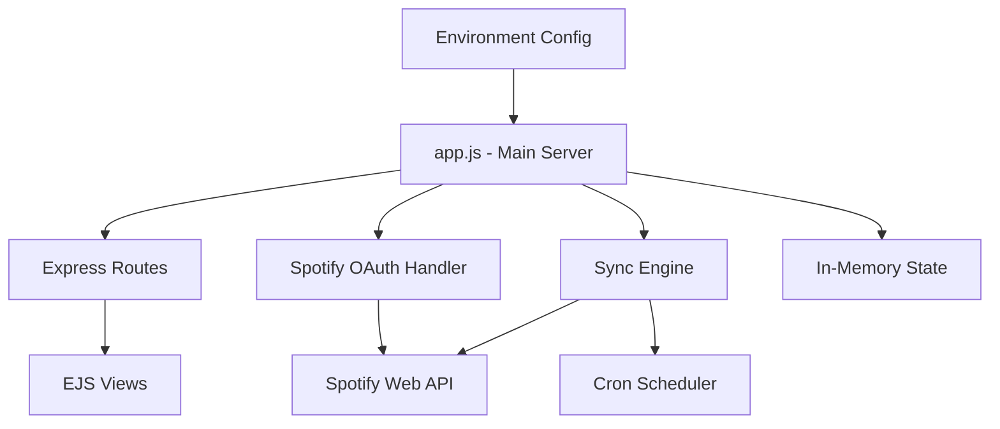

# CLAUDE.md

This file provides guidance to Claude Code (claude.ai/code) when working with code in this repository.

## Project Overview

BigBrain Sync Buddy is a Node.js web application that synchronizes Spotify playlists between two accounts. It implements OAuth 2.0 authentication and provides a web-based dashboard for monitoring sync status.

## Key Commands

```bash
# Development (with auto-reload)
npm run dev

# Production
npm start

# Syntax validation
npm test
```

## Architecture

The application follows a monolithic architecture with all logic in `app.js`:



### Core Components

1. **OAuth Flow** (app.js:202-271): Handles Spotify authentication with token exchange and automatic refresh
2. **Sync Engine** (app.js:346-434): One-way playlist synchronization with duplicate prevention and track removal
3. **State Management** (app.js:124-175): In-memory state with JSON file persistence (`app-data.json`)
4. **Logging** (app.js:28-101): Winston-based logging with daily rotation to `logs/` directory
5. **Web Interface** (views/): EJS templates for dashboard UI

### Key Design Decisions

- **No Database**: State is in-memory with file persistence (survives restarts via `app-data.json`)
- **One-Way Sync**: Source account playlists are never modified
- **Automatic Discovery**: Syncs all user-owned playlists without manual selection
- **Local-Only by Default**: Binds to 127.0.0.1 for security (configurable via HOST)

## Environment Configuration

Required `.env` variables:
- `SPOTIFY_CLIENT_ID` - From Spotify app dashboard
- `SPOTIFY_CLIENT_SECRET` - From Spotify app dashboard
- `SPOTIFY_REDIRECT_URI` - Must match Spotify app config (default: `http://127.0.0.1:3000/callback`)

Optional `.env` variables:
- `HOST` (default: 127.0.0.1) - Set to `0.0.0.0` for network access
- `PORT` (default: 3000)
- `LOG_LEVEL` (default: info) - error, warn, info, debug
- `SYNC_INTERVAL_MINUTES` (default: 30)
- `ENABLE_AUTO_SYNC` (default: false) - Set to `true` for scheduled syncing

## Git Commands (Windows/PowerShell)

This project runs on Windows. Use PowerShell for all git operations:

```powershell
# Check status
powershell -Command "cd 'C:\bigbrain\bigbrain-sync-buddy'; git status"

# View changes
powershell -Command "cd 'C:\bigbrain\bigbrain-sync-buddy'; git diff"

# Stage specific files
powershell -Command "cd 'C:\bigbrain\bigbrain-sync-buddy'; git add app.js views/index.ejs"

# Commit with message
powershell -Command "cd 'C:\bigbrain\bigbrain-sync-buddy'; git commit -m 'Your commit message'"

# Push to remote
powershell -Command "cd 'C:\bigbrain\bigbrain-sync-buddy'; git push"

# View recent commits
powershell -Command "cd 'C:\bigbrain\bigbrain-sync-buddy'; git log --oneline -5"
```

## Development Notes

- Node.js 20+ LTS required per package.json (startup exits if <16, warns at 16-19)
- Uses Express 5.0.1 (latest major version)
- No test framework configured - `npm test` only does syntax checking
- Logs written to `logs/` directory with daily rotation (Winston)
- State persisted to `app-data.json` (reloaded on startup)

## API Reference

- `GET /` - Dashboard UI
- `GET /callback` - Spotify OAuth callback (state param determines account type)
- `POST /sync` - Manual sync trigger
- `POST /disconnect` - Clear all stored tokens and reset state
- `POST /sync-interval` - Update sync interval (body: `{ interval: minutes }`, range 1-1440)
- `POST /build-rons-radio` - Build "Ron's Radio" playlist on source account (collects tracks from all "Best Of" playlists, filters out country music by artist genre)
- `GET /status` - JSON status for UI polling
- `GET /logs` - List available log files
- `GET /logs/:filename` - Download specific log file
- `GET /debug` - Token status debugging info
- `GET /test-tokens` - Validate stored tokens against Spotify API