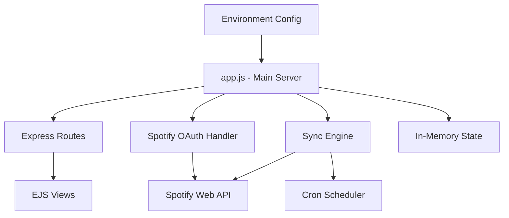

# CLAUDE.md

This file provides guidance to Claude Code (claude.ai/code) when working with code in this repository.

## Project Overview

BigBrain Sync Buddy is a Node.js web application that synchronizes Spotify playlists between two accounts. It implements OAuth 2.0 authentication and provides a web-based dashboard for monitoring sync status.

## Key Commands

```bash
# Development (with auto-reload)
npm run dev

# Production
npm start

# Syntax validation
npm test
```

## Architecture

The application follows a monolithic architecture with all logic in `app.js`:



### Core Components

1. **OAuth Flow** (app.js:45-130): Handles Spotify authentication for both source and destination accounts
2. **Sync Engine** (app.js:205-338): One-way playlist synchronization logic with duplicate prevention
3. **State Management** (app.js:19-26): In-memory storage for tokens and sync state
4. **Web Interface** (views/): EJS templates for dashboard UI

### Key Design Decisions

- **No Database**: All state is in-memory and resets on restart
- **One-Way Sync**: Source account playlists are never modified
- **Automatic Discovery**: Syncs all user-owned playlists without manual selection
- **Local-Only**: Binds to 127.0.0.1 for security

## Environment Configuration

Required `.env` variables:
- `SPOTIFY_CLIENT_ID` - From Spotify app dashboard
- `SPOTIFY_CLIENT_SECRET` - From Spotify app dashboard
- `PORT` (optional, default: 3000)

Redirect URI must be: `http://localhost:3000/callback`

## Development Notes

- Node.js 20+ LTS required (validated on startup)
- Uses Express 5.0.1 (latest major version)
- No test framework configured - only syntax checking
- Auto-formatting configured for VS Code
- Default sync interval: 30 minutes (configurable via cron expression)

## API Reference

- `GET /` - Dashboard UI
- `GET /callback?account={source|destination}` - OAuth callback
- `POST /sync` - Manual sync trigger
- `POST /disconnect` - Clear all stored tokens
- `GET /status` - JSON status for UI polling